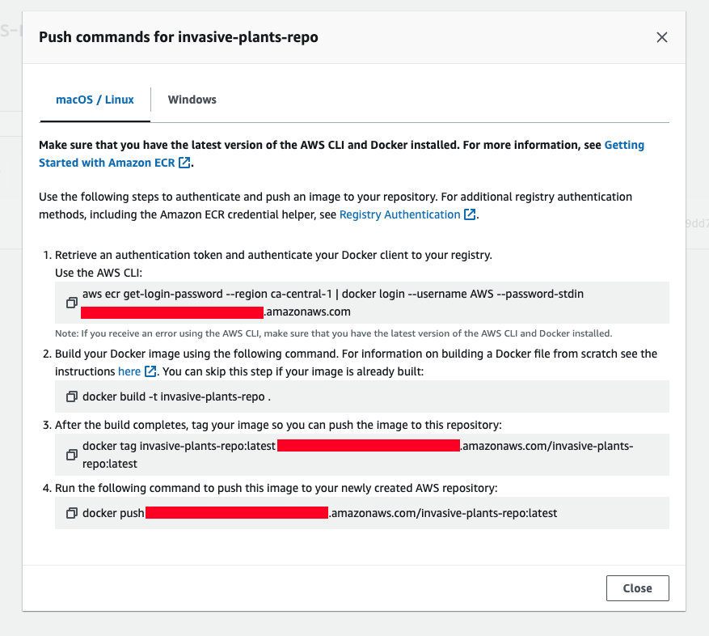
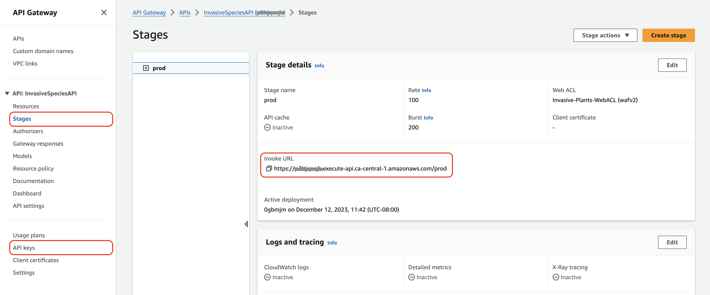

# Requirements

Before you deploy, you must have the following installed on your device:

- [git](https://git-scm.com/downloads)
- [git lfs](https://git-lfs.com/)
- [AWS Account](https://aws.amazon.com/account/)
- [GitHub Account](https://github.com/)
- [AWS CLI](https://aws.amazon.com/cli/)
- [AWS CDK](https://docs.aws.amazon.com/cdk/latest/guide/cli.html)
- [Docker](https://www.docker.com/products/docker-desktop/)
- an IDE, such as [VS Code](https://code.visualstudio.com/download)

If you are on a Windows device, it is recommended to install the [Windows Subsystem For Linux](https://docs.microsoft.com/en-us/windows/wsl/install), which lets you run a Linux terminal on your Windows computer natively. Some of the steps will require its use. [Windows Terminal](https://apps.microsoft.com/store/detail/windows-terminal/9N0DX20HK701) is also recommended for using WSL.

## Deployment walkthrough

### Table of Contents

- [Requirements](#requirements)
  - [Deployment walkthrough](#deployment-walkthrough)
    - [Table of Contents](#table-of-contents)
  - [Step 1: Clone The Repository](#step-1-clone-the-repository)
  - [Step 2: Local Deployment](#step-2-local-deployment)
  - [Step 3: Cloud Deployment](#step-3-cloud-deployment)
    - [Step 1: Install Dependencies](#step-1-install-dependencies)
    - [Step 2: Upload Database Secrets](#step-2-upload-database-secrets)
    - [Step 3: CDK Deployment](#step-3-cdk-deployment)
      - [1. Create Elastic Container Registry (ECR)](#1-create-elastic-container-registry-ecr)
      - [2. Create and Push Docker Image to ECR](#2-create-and-push-docker-image-to-ecr)
      - [3. Deploy all stacks](#3-deploy-all-stacks)
    - [Extra: Finding important values](#extra-finding-important-values)
    - [Extra: Taking down the deployed stacks](#extra-taking-down-the-deployed-stacks)

## Step 1: Clone The Repository

First, clone the GitHub repository onto your machine. To do this:

1. Create a folder on your computer to contain the project code.
2. For an Apple computer, open Terminal. If on a Windows machine, open Command Prompt or Windows Terminal. Enter into the folder you made using the command `cd path/to/folder`. To find the path to a folder on a Mac, right-click on the folder and press `Get Info`, then select the whole text found under `Where:` and copy with ⌘C. On Windows (not WSL), enter the folder on File Explorer and click on the path box (located to the left of the search bar), then copy the whole text that shows up.
3. Clone the GitHub repository by entering the following:

```bash
git clone https://github.com/UBC-CIC/InvasivePlants.git
```

The code should now be in the folder you created. Navigate into the root folder containing the entire codebase by running the command:

```bash
cd InvasivePlants
```

To open the repo in VS Code, run:

```bash
code .
```

## Step 2: Local Deployment

For local deployment, we only need to add an `.env` file in `InvasivePlants/frontend/`. Assuming you are in `InvasivePlants`, you can navigate into this directory by running

```bash
cd frontend
```

Note that even though this is a local deployment, one still need to deploy all other CDK stacks except `hostStack`. The `.env` file should have the following values:

```bash
REACT_APP_USERPOOL_ID
REACT_APP_USERPOOL_WEB_CLIENT_ID
REACT_APP_REGION
REACT_APP_API_BASE_URL
REACT_APP_S3_BASE_URL
REACT_APP_IDENTITY_POOL_ID
```

Note: make sure to put forward slash, `/`, at the end of the link.

Then, one can install all packages at `InvasivePlants/frontend/` using:

```bash
npm install
```

Afterward, one can run the application by running:

```bash
npm start
```

## Step 3: Cloud Deployment


It's time to set up everything that goes on behind the scenes and host it! For more information on how the backend works, feel free to refer to the [Architecture Deep Dive](./ArchitectureDeepDive.md), but an understanding of the backend is not necessary for deployment.

### Step 1: Install Dependencies

The first step is to get into the backend folder. Assuming you are currently still in `InvasivePlants/frontend` with the application running, you can terminate the application using `Ctrl + C`. To navigate back to the root directory, run:

```bash
cd ..
```

then navigate to `InvasivePlants/backend` using:

```bash
cd backend
```

Now that you are in the backend directory, install the core dependencies with the following command:

```bash
npm install
```

### Step 2: Upload Database Secrets

You would have to supply a custom database username when deploying the solution to increase security. Run the following command and ensure you replace YOUR-DB-USERNAME with the custom name of your choice.

```bash
aws secretsmanager create-secret \
    --name InvasivePlantsSecrets \
    --secret-string "{\"DB_Username\":\"<YOUR-DB-USERNAME>\"}"\
    --profile <your-profile-name>
```

For example,

```bash
aws secretsmanager create-secret \
    --name InvasivePlantsSecrets \
    --secret-string "{\"DB_Username\":\"InvasivePlants\"}"\
    --profile <your-profile-name>
```

### Step 3: CDK Deployment

Initialize the CDK stacks (required only if you have not deployed this stack before). Note this CDK deployment was tested in `ca-central-1` region only.

```bash
cdk synth --profile <aws-profile-name>
cdk bootstrap --profile <aws-profile-name>
```

For CDK deployment, we are going to do the following:

1. [Create Elastic Container Registry (ECR)](#1-create-elastic-container-registry-ecr)
2. [Create a Docker image and push it to ECR](#2-create-and-push-docker-image-to-ecr)
3. [Deploy all stacks](#3-deploy-all-stacks)

Most of the commands assume you are in `InvasivePlants/backend/` directory unless the instruction says to change the directory.

#### 1. Create Elastic Container Registry (ECR)

This will create a repository called `invasive-plants-repo`.

Note: The default platform intended for the container is --platform=linux/amd64. Might be able to run on MacOS. For Windows, you probably have to get rid of the flag inside the Dockerfile before building.

Run the following command to create an ECR repository.

```bash
cdk deploy ECRStack --profile <aws-profile-name>
```

#### 2. Create and Push Docker Image to ECR

Once a repository is created, we can create and push Docker images. Navigate back to the `InvasivePlants` directory.

1. Go to ECR in AWS Console
2. Look for `invasive-plants-repo` repository
3. Click on `View push commands` and follow the instructions\*
4. Make sure you have Docker daemon running

This is a sample of the `View push commands`:



\*Note: in Step 1 of the instructions, you can specify which profile to use by specifying in the following:

```bash
aws ecr get-login-password --region ca-central-1 --profile <aws-profile-name>| docker login --username AWS --password-stdin <link-to-ecr>
```

#### 3. Deploy all stacks

This step will create the following CloudFormation stacks:

- `Cloudfront-WAFWebACL` - creates a CLOUDFRONT Web ACL in `us-east-1` region
- `VpcStack` - creates a VPC
- `FunctionalityStack` - creates fuctional services like Cognito, S3, Cloudfront distribution
- `DBStack` - creates RDS database
- `DBFlowStack` - loads existing data to database
- `APIStack` - creates an API Gateway and Lambdas that attach with each endpoints
- `hostStack` - launches the admin page to ECS fronted by CloudFront (for local deployment, you can skip this step)

Navigate to the `/InvasivePlants/backend/` directory. This deployment will take time. If your login session is short, you can always deploy one stack at a time in the order above.

The deployment command for the `hostStack` requires a parameter calls `prefixListID` which is used for ALB security group. This value can be obtained from the table below, based on the region that the `hostStack` deploys to.

| Region Code    | PL Code     |
| -------------- | ----------- |
| ap-northeast-1 | pl-58a04531 |
| ap-northeast-2 | pl-22a6434b |
| ap-south-1     | pl-9aa247f3 |
| ap-southeast-1 | pl-31a34658 |
| ap-southeast-2 | pl-b8a742d1 |
| ca-central-1   | pl-38a64351 |
| eu-central-1   | pl-a3a144ca |
| eu-north-1     | pl-fab65393 |
| eu-west-1      | pl-4fa04526 |
| eu-west-2      | pl-93a247fa |
| eu-west-3      | pl-75b1541c |
| sa-east-1      | pl-5da64334 |
| us-east-1      | pl-3b927c52 |
| us-east-2      | pl-b6a144df |
| us-west-1      | pl-4ea04527 |
| us-west-2      | pl-82a045eb |

Then, use the following command below and pass in the `prefixListID` value.

```bash
cdk deploy FunctionalityStack \
  --parameters hostStack:prefixListID=<your-region-preFixListId> \
  --profile <aws-profile-name>
```

```bash
cdk deploy --all \
  --parameters hostStack:prefixListID=<your-region-preFixListId> \
  --profile <aws-profile-name>
```

For example, the `prefixListID` for `ca-central-1` is `pl-38a64351`, so we have the following command:

```bash
cdk deploy --all \
  --parameters hostStack:prefixListID=pl-38a64351 \
  --profile AWSProfileSSO
```

If you have trouble running the above command, try removing all the `\` and run it in one line.

### Extra: Finding important values

After deployment is completed, look for the following in the terminal:

- `Hosted Website URL` - this is the hosted admin page URL which can be accessed through a browser



To get api base url:

1. Go to API Gateway in the AWS Console and click on the project api
2. Go to `Stages` and look for `Invoke URL`

### Extra: Taking down the deployed stacks

To take down the deployed stack for a fresh redeployment in the future, navigate to AWS Cloudformation, click on the stack(s), and hit Delete. Please wait for the stacks in each step to be properly deleted before deleting the stack downstream.

Also make sure to delete secrets in Secrets Manager and a stack in `us-east-1`.
