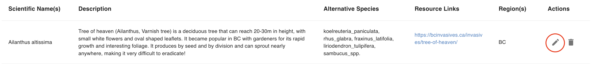
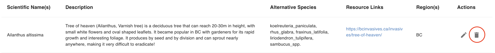

# User Guide

**Before Continuing with this User Guide, please make sure you have deployed the frontend and backend stacks.**

- [Deployment Guides](./DeploymentGuide.md)

Once you have deployed the solution, the following user guide will help you navigate the functions available.

| Index                              | Description                                                |
| :--------------------------------- | :----------------------------------------------------------|
| [Invasive Species](#invasive-species) | Walkthrough of the Invasive Species page   |
| [Alternative Species](#alternative-species) | Walkthrough of the Alternative Species page   |
| [Regions](#regions)  | Walkthrough of the Regions page |

## Invasive Species
The Invasive Species page is the default page after login. This page displays a table of the invasive species available in the database with information including:

- **Scientific Name(s)** - the scientific name(s) of the invasive species
- **Description** - a description of the invasive species
- **Alternative Species** - non-invasive species to plant instead
- **Resource Links** - external resources
- **Region(s)** - the region(s) where the species is/are invasive

At the top of the page, the administrator can filter the species by region and also search up invasive species by scientific name. The administrator can also select the number of species to display on each page. 

The following image shows the result of searching up the species *Digitalis purpurea*. 

### Adding a new species
To add an invasive species, click on the *+ ADD INVASIVE SPECIES* button below the search filters. This will open up a dialog with fields to complete. The fields marked with an asterisk are mandatory, the rest are optional. 

### Editing an existing species
To edit an invasive species, click on the edit icon in the Actions column. 

This will open up a dialog with the existing species' information that can be edited.

### Deleting an existing species
To delete an invasive species, click on the delete icon in the Actions column. 

A confirmation alert will appear on screen asking for confirmation before deletion.

## Alternative Species

## Regions