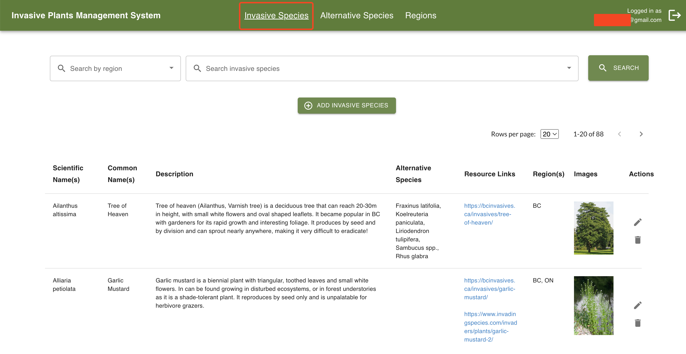
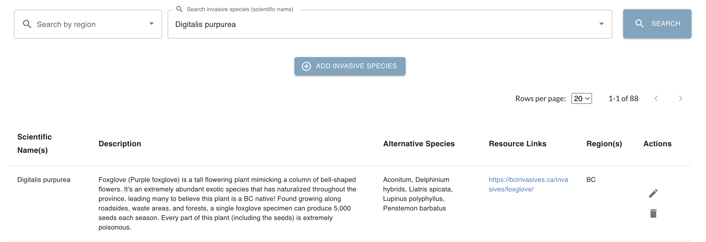
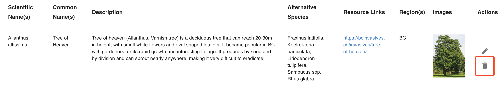
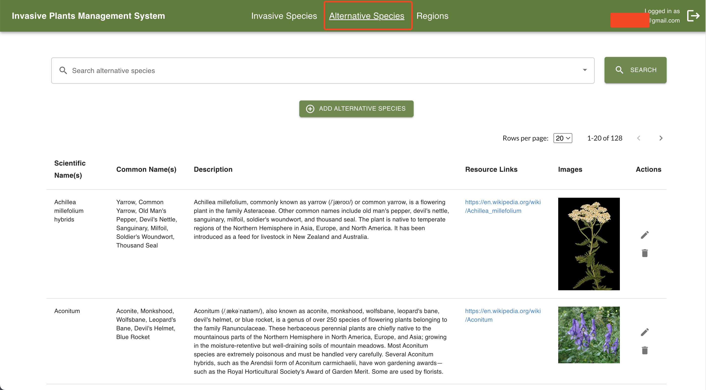
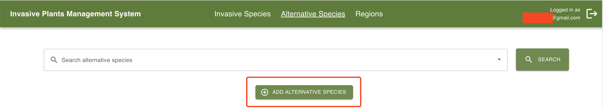

# User Guide

**Before Continuing with this User Guide, please make sure you have deployed the frontend and backend stacks.**

- [Deployment Guides](./DeploymentGuide.md)

Once you have deployed the solution, the following user guide will help you navigate the functions available.

| Index                              | Description                                                |
| :--------------------------------- | :----------------------------------------------------------|
| [Invasive Species](#invasive-species) | Walkthrough of the Invasive Species page   |
| [Alternative Species](#alternative-species) | Walkthrough of the Alternative Species page   |
| [Regions](#regions)  | Walkthrough of the Regions page |

## Invasive Species
The Invasive Species page is the default page after login. This page displays a table of the invasive species available in the database with information including:

- **Scientific Name(s)** - the scientific name(s) of the invasive species
- **Description** - a description of the invasive species
- [**Alternative Species**](#alternative-species) - non-invasive species to plant instead
- **Resource Links** - external resources
- [**Region(s)**](#regions)   - the region(s) where the species is/are invasive

At the top of the page, the administrator can search up an invasive species by region and scientific name. The administrator can also select the number of species to display on each page. 

The following image shows the result of searching up the species *Digitalis purpurea*. 

### Adding an invasive species
To add an invasive species, click on the button below the search filters. 

This will open up a dialog with fields to complete. The fields marked with an asterisk are mandatory, the rest are optional. 

### Editing an invasive species
To edit an invasive species, click on the edit icon in the Actions column for the species you want to edit. 

This will open up a dialog with the selected species' information that can be edited. Again, mandatory fields are marked with an asterisk.

### Deleting an invasive species
To delete an invasive species, click on the delete icon in the Actions column for the species you want to delete. 

A confirmation alert will appear on screen asking for confirmation before deletion.

## Alternative Species
The Alternative Species page displays a table of the alternative species available in the database. These are the species available to be selected for each [invasive species](#invasive-species) as alternative/non-invasive species to plant instead. The table includes the following information:

- **Scientific Name(s)** - the scientific name(s) of the alternative species
- **Common Name(s)** -- the common name(s) of the alternative species
- **Description** - a description of the alternative species
- **Resource Links** - external resources
- **Images** - images of the alternative species, which can be both external image links or user-uploaded image files

At the top of the page, the administrator can search up an alternative species by its scientific name. The administrator can also select the number of species to display on each page. 

### Adding an alternative species
To add an alternative species, click on the button below the search filters. 

This will open up a dialog with fields to complete. The fields marked with an asterisk are mandatory, the rest are optional. 

### Editing an alternative species
To edit an alternative species, click on the edit icon in the Actions column for the species you want to edit, just like when [editing an invasive species](#editing-an-invasive-species).

This will open up a dialog with the selected species' information that can be edited. Again, mandatory fields are marked with an asterisk.

### Deleting an alternative species
The steps for deleting an alternative species are the same as [deleting an invasive species](#deleting-an-invasive-species). 

## Regions
The Regions page displays a table of the regions available in the database. These are the regions available to be selected for each [invasive species](#invasive-species) as the regions in which the species is invaisve. The table includes the following information:

- **Region** - the full name of the region
- **Region Code** -- the abbrieviated name/code representing the region
- **Country** - the country in which the region resides in
- **Geographic Coordinates (latitude, longitude)** - the latitude and longitude of the region. The current data was taken from this [website](https://www.latlong.net/category/provinces-40-60.html)

At the top of the page, the administrator can search up a region species by its name. The administrator can also select the number of species to display on each page. 

### Adding a region
To add an alternative species, click on the button below the search filters. 

This will open up a dialog with fields to complete. The fields marked with an asterisk are mandatory, the rest are optional. 

### Editing a region
To edit a region, click on the edit icon in the Actions column for the region you want to edit, just like when [editing an invasive species](#editing-an-invasive-species).

This will open up a dialog with the selected region's information that can be edited. Again, mandatory fields are marked with an asterisk.

### Deleting a region
The steps for deleting a region are the same as [deleting an invasive species](#deleting-an-invasive-species). 